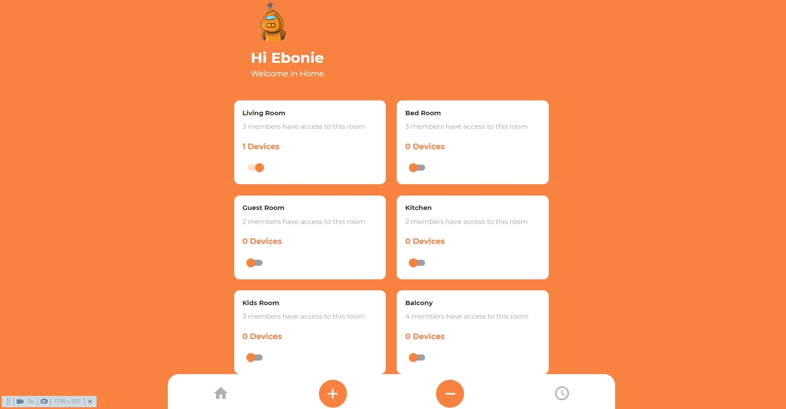

# Smart Home
[<------------Go to page------------>](https://smart-home-portfolio.netlify.app/)

## Technologies used in project

> ⭐ React  
> ⭐ React Router  
> ⭐ Styled Components  
> ⭐ Axios  
> ⭐ Notistack  
> ⭐ Material UI  
> ⭐ RWD

## How to use

### 1. Clone it
> `git clone https://github.com/KrzysztofBartkiewicz/smart-home-app.git`
### 2. Install
> `npm install`
### 3. Run
> `npm start`

## About project
> Simple app simulating contol of home devices
